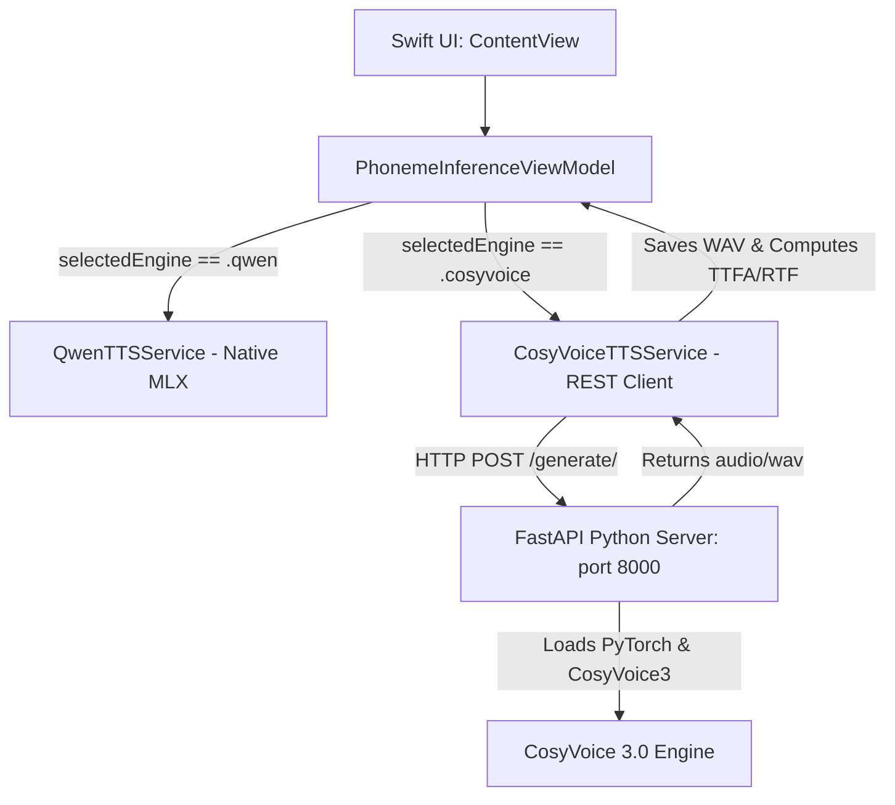

# Integration Plan: CosyVoice 3 FastAPI Python Bridge

This document details the plan for bridging the CosyVoice 3.0 python engine with our native Swift frontend (`PhonemeInferenceSandbox`) using a local FastAPI server.

## Overview
Due to compilation and runtime issues porting CosyVoice 3 directly to native Swift MLX (shape alignment, STFT differences, and weight mapping complexity), we are pivoting to a local Python FastAPI bridge. Qwen3-TTS will continue to run as the native, in-process MLX alternative, while CosyVoice 3 will operate via local HTTP loopback.



---

## Phase 1: Python FastAPI Bridge Implementation
We will enhance and finalize [server_cosyvoice.py](file:///Users/vio/PycharmProjects/text-to-speech/scripts/tts_engine/server_cosyvoice.py) to act as a robust backend for the Swift app.

### 1. Endpoint: `/generate/` (`POST`)
* **Request Format:** `multipart/form-data`
* **Form Parameters:**
  - `target_text` (String): The text to generate.
  - `reference_text` (String, Optional): Transcription of the reference voice file. If not provided, the server will auto-transcribe the reference audio using Whisper.
  - `reference_audio` (File): A `.wav` voice file containing the speaker's voice to clone.
  - `speed` (Float, Optional): Speaking rate adjustment (default: `1.0`).
  - `mode` (String, Optional): `zero_shot` or `cross_lingual`.
* **Response:** `audio/wav` stream/file payload.

### 2. Core Python Server Logic
1. **Dynamic Slicing & Safety Check (Optimal 3s - 10s):**
   - CosyVoice is trained on short reference audio clips. Audio longer than 10 seconds degrades style/timbre cloning performance due to attention dilution in the autoregressive LLM.
   - If `reference_audio` is longer than 10 seconds, the server will semantically slice it (using Whisper word/sentence boundaries) to an optimal **3s to 10s** window.
2. **Automated Transcription:**
   - The server will run a lightweight Whisper model (`base` or `tiny`) on the sliced reference audio to generate the required `reference_text` on the fly. This completely removes the need for manual transcription input from the Swift client.
3. **Speed Normalization:**
   - Iterate over the CosyVoice generator output, concatenate the PyTorch speech tensors, and save the final wave file to a temporary location to serve it back.

---

## Phase 2: Swift Frontend Integration ([PhonemeInferenceSandbox](file:///Users/vio/PycharmProjects/text-to-speech/PhonemeInferenceSandbox))

### 1. Refactoring [CosyVoiceTTSService.swift](file:///Users/vio/PycharmProjects/text-to-speech/PhonemeInferenceSandbox/PhonemeInferenceSandbox/CosyVoiceTTSService.swift)
We will deprecate the native Swift MLX models and replace them with an HTTP URLSession client.

* **API Signatures (to maintain protocol parity):**
  ```swift
  public actor CosyVoiceTTSService: TTSServiceProtocol {
      public static let shared = CosyVoiceTTSService()
      
      public var isReady: Bool {
          // Returns true if server connectivity is verified or default active
          return true 
      }
      
      public func initialize() async throws {
          // Perform a GET check to FastAPI /health to ensure bridge is alive
      }
      
      public func generateAudio(
          text: String,
          referenceAudioURL: URL?,
          isMultiLanguage: Bool = false,
          language: String = "Auto",
          speed: Float = 1.0
      ) async throws -> (URL, Double, Double) {
          // HTTP POST logic here
      }
  }
  ```

* **Multipart Upload Implementation Details:**
  - Create a random boundary string.
  - Construct HTTP body data enclosing the parameters:
    - Content-Disposition for `target_text`, `reference_text`, and `speed`.
    - Binary data attachment for the audio file at `referenceAudioURL`.
  - Perform the `URLSession.shared.data(for: request)` request.

* **Metrics Calculation:**
  - **TTFA (Time to First Audio):** Record `CFAbsoluteTimeGetCurrent()` at start, and check the time when response headers and first data chunk are received.
  - **RTF (Real-Time Factor):** Total network request duration divided by the duration of the synthesized audio WAV file.

---

## Phase 3: ViewModel & Connectivity Warning
In [PhonemeInferenceViewModel.swift](file:///Users/vio/PycharmProjects/text-to-speech/PhonemeInferenceSandbox/PhonemeInferenceSandbox/PhonemeInferenceViewModel.swift):

* **Connectivity Check on Load:**
  When `loadModel()` is called, ping `http://localhost:8000/health`. If it is unreachable:
  - Update `statusMessage` to: `"CosyVoice Python server is offline. Please run the server in terminal."`
  - Disable CosyVoice selection or show a warning popup.
* **Streamline Init:**
  Eliminate the wait for local weights loading. The app will boot up immediately.

---

## Phase 4: Verification and Parity Testing
1. **Start Server:**
   ```bash
   python server_cosyvoice.py
   ```
2. **Run App:** Launch `PhonemeInferenceSandboxApp`.
3. **Perform Generation:** Select `CosyVoice3` as the active engine, type target script, select a saved cloning voice, and press **Generate Baseline**.
4. **Scoring:** Record user voice speaking the same text, run Wav2Vec2 phonetic scorer locally, and verify pronunciation scoring works correctly on the generated bridge baseline.
