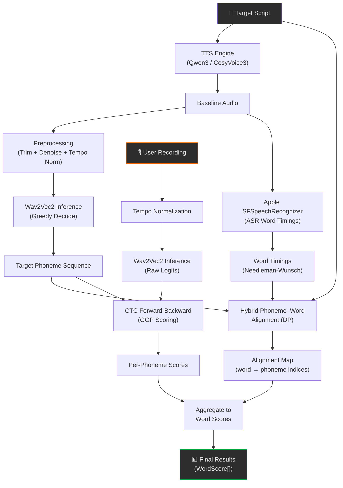
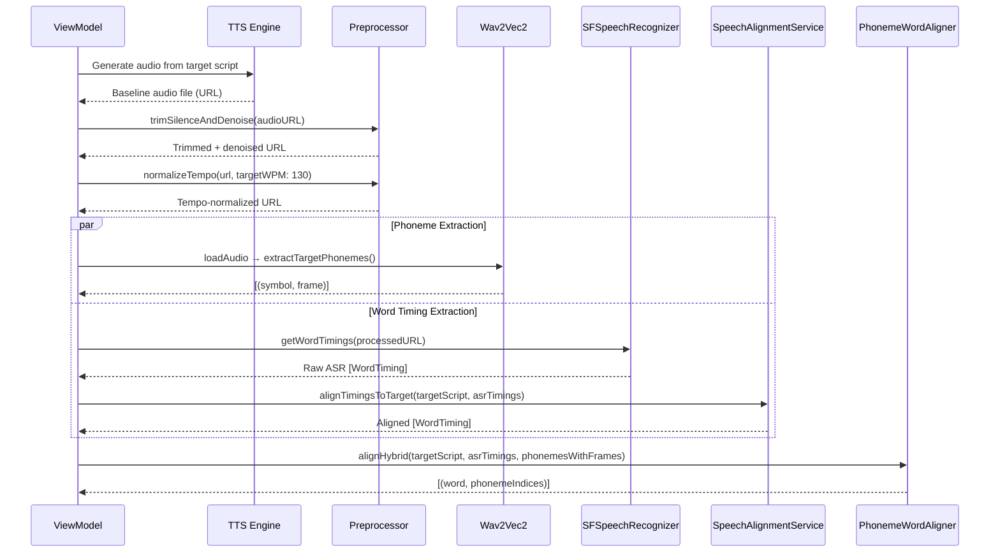
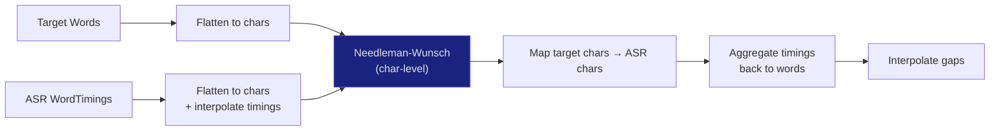
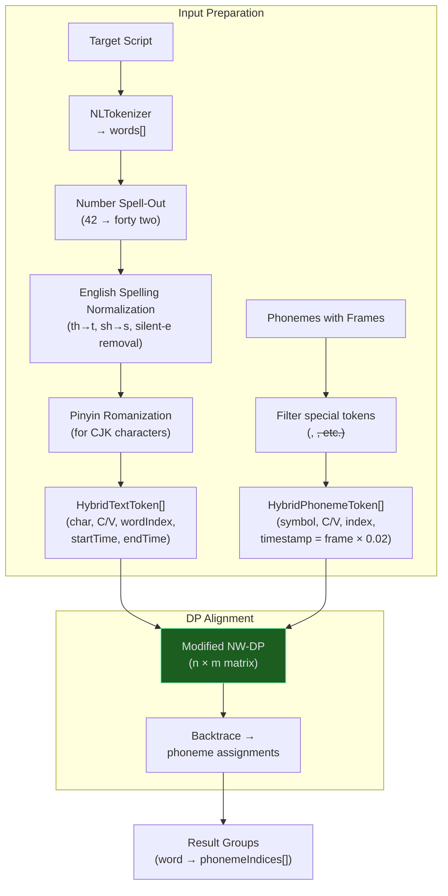
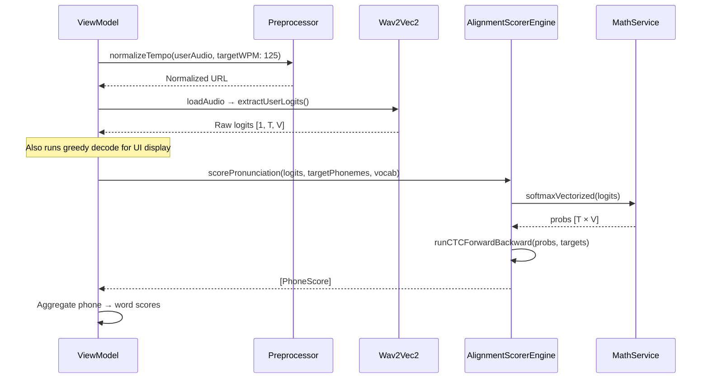
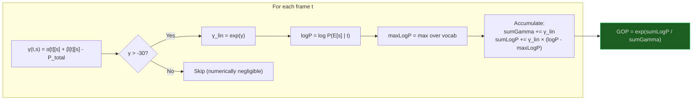
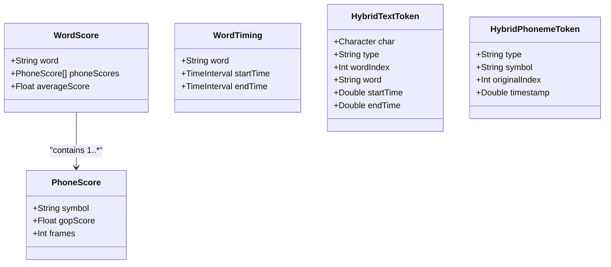
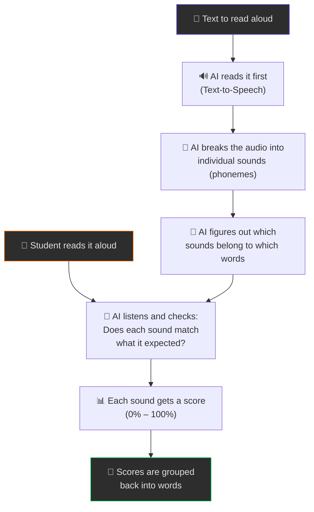

# Phoneme Alignment & Scoring Pipeline

> Technical deep-dive into the pronunciation evaluation system in **PhonemeInferenceSandbox**.

---

## 1. High-Level Overview

The pipeline evaluates a user's pronunciation against a TTS-generated baseline.
It answers the question: *"How accurately did the user pronounce each word and phoneme of the target script?"*



The system has two major phases:

| Phase | Purpose | Key Output |
|-------|---------|------------|
| **Baseline Generation** | Establish the ground-truth phoneme sequence and word–phoneme alignment from TTS audio | `targetPhonemes[]`, `targetWordAlignments[]` |
| **User Scoring** | Score the user's pronunciation of each target phoneme using CTC posterior probabilities | `phoneScores[]`, `wordScores[]` |

---

## 2. Source File Map

| File | Role |
|------|------|
| [PhonemeInferenceViewModel.swift](file:///Users/vio/PycharmProjects/text-to-speech/PhonemeInferenceSandbox/PhonemeInferenceSandbox/ViewModels/PhonemeInferenceViewModel.swift) | Orchestrator — drives the entire pipeline |
| [AudioInferenceEngine.swift](file:///Users/vio/PycharmProjects/text-to-speech/PhonemeInferenceSandbox/PhonemeInferenceSandbox/Evaluation/AudioInferenceEngine.swift) | Wav2Vec2 CoreML inference + CTC greedy decode |
| [SpeechAlignmentService.swift](file:///Users/vio/PycharmProjects/text-to-speech/PhonemeInferenceSandbox/PhonemeInferenceSandbox/Evaluation/SpeechAlignmentService.swift) | Apple ASR word timings + Needleman-Wunsch timing alignment |
| [PhonemeWordAligner.swift](file:///Users/vio/PycharmProjects/text-to-speech/PhonemeInferenceSandbox/PhonemeInferenceSandbox/Evaluation/PhonemeWordAligner.swift) | Phoneme → word alignment (both legacy CV and hybrid DP) |
| [AlignmentScorerEngine.swift](file:///Users/vio/PycharmProjects/text-to-speech/PhonemeInferenceSandbox/PhonemeInferenceSandbox/Evaluation/AlignmentScorerEngine.swift) | CTC forward-backward GOP scoring |
| [MathService.swift](file:///Users/vio/PycharmProjects/text-to-speech/PhonemeInferenceSandbox/PhonemeInferenceSandbox/Services/MathService.swift) | Vectorized softmax (Accelerate/vDSP) |
| [AudioService.swift](file:///Users/vio/PycharmProjects/text-to-speech/PhonemeInferenceSandbox/PhonemeInferenceSandbox/Services/AudioService.swift) | Audio loading, resampling to 16 kHz, zero-mean/unit-var normalization |
| [AudioRecordingService.swift](file:///Users/vio/PycharmProjects/text-to-speech/PhonemeInferenceSandbox/PhonemeInferenceSandbox/Services/AudioRecordingService.swift) | Mic recording, silence trimming, high-pass denoising, tempo normalization |

---

## 3. Phase 1 — Baseline Generation

Triggered by `generateBaseline()` in the ViewModel.



### 3.1 Audio Preprocessing

Before any inference, the baseline TTS audio goes through two stages:

#### 3.1.1 Silence Trimming & Denoising ([trimSilenceAndDenoise](file:///Users/vio/PycharmProjects/text-to-speech/PhonemeInferenceSandbox/PhonemeInferenceSandbox/Services/AudioRecordingService.swift#L180-L273))

1. **VAD (Voice Activity Detection)**: Scans forward and backward for the first sample exceeding a `0.015` amplitude threshold (~-36 dB). Keeps 100 ms padding on each side.
2. **High-pass Filter**: Applies an 80 Hz high-pass EQ to remove low-frequency rumble and TTS hallucination artifacts. Rendered offline via `AVAudioEngine`.

#### 3.1.2 Tempo Normalization ([normalizeTempo](file:///Users/vio/PycharmProjects/text-to-speech/PhonemeInferenceSandbox/PhonemeInferenceSandbox/Services/AudioRecordingService.swift#L100-L176))

Normalizes speaking rate to a target WPM (130 for baseline, 125 for user audio):

```
currentWPM = (wordCount / duration) × 60
rate = targetWPM / currentWPM     (clamped to [0.7, 1.3])
```

Uses `AVAudioUnitTimePitch` for pitch-preserving time-stretching, rendered offline. Skipped if the rate adjustment is < 5%.

> [!NOTE]
> Tempo normalization is critical because Wav2Vec2's frame-level output assumes a consistent frame rate (20 ms/frame). Wildly different speaking speeds would distort the phoneme-to-frame mapping.

### 3.2 Audio Loading & Normalization ([AudioService.loadAudio](file:///Users/vio/PycharmProjects/text-to-speech/PhonemeInferenceSandbox/PhonemeInferenceSandbox/Services/AudioService.swift#L6-L59))

1. Reads the WAV file via `AVAudioFile`
2. Resamples to **16 kHz mono float32** (Wav2Vec2's expected input)
3. Applies **zero-mean, unit-variance normalization** via `vDSP_normalize`
4. Packs into `MLMultiArray` with shape `[1, numSamples]`

### 3.3 Phoneme Extraction ([AudioInferenceEngine](file:///Users/vio/PycharmProjects/text-to-speech/PhonemeInferenceSandbox/PhonemeInferenceSandbox/Evaluation/AudioInferenceEngine.swift))

The app uses a **Wav2Vec2-based phonetic model** (`Wav2Vec2Phonetic.mlpackage`) compiled to CoreML. The vocabulary contains **~350 IPA phoneme tokens** plus special tokens (`<pad>`, `<s>`, `</s>`, `<unk>`).

#### Greedy CTC Decode ([runGreedyDecodeWithFrames](file:///Users/vio/PycharmProjects/text-to-speech/PhonemeInferenceSandbox/PhonemeInferenceSandbox/Evaluation/AudioInferenceEngine.swift#L33-L60))

```
For each frame t in [0, T):
    bestToken = argmax(logits[t, :])
    if bestToken ≠ <pad> AND bestToken ≠ previousToken:
        emit (vocabulary[bestToken], frame=t)
```

This is standard CTC greedy decoding with blank-collapse and duplicate-removal. Each emitted phoneme retains its **frame index**, which converts to a timestamp via `frame × 0.02s` (Wav2Vec2's 20 ms stride).

**Two inference modes:**

| Method | Returns | Used For |
|--------|---------|----------|
| `extractTargetPhonemes()` | `[(symbol, frame)]` | Baseline — provides the target phoneme sequence |
| `extractUserLogits()` | Raw `MLMultiArray` logits | User scoring — raw logits are needed for CTC forward-backward |

### 3.4 ASR Word Timing Extraction ([SpeechAlignmentService](file:///Users/vio/PycharmProjects/text-to-speech/PhonemeInferenceSandbox/PhonemeInferenceSandbox/Evaluation/SpeechAlignmentService.swift))

Uses Apple's `SFSpeechRecognizer` (on-device) to transcribe the preprocessed baseline audio and extract per-word timestamps.

#### Timing Alignment to Target Script ([alignTimingsToTarget](file:///Users/vio/PycharmProjects/text-to-speech/PhonemeInferenceSandbox/PhonemeInferenceSandbox/Evaluation/SpeechAlignmentService.swift#L91-L223))

The ASR transcript often doesn't match the target script exactly (different words, different tokenization). This method re-aligns ASR timings to the target words:



**Algorithm**: Needleman-Wunsch global sequence alignment on flattened characters.

| Parameter | Value |
|-----------|-------|
| Match score | +2 |
| Mismatch score | -1 |
| Gap penalty | -1 |

**Character matching** uses `CFStringTransform` with `kCFStringTransformMandarinLatin` + `kCFStringTransformStripDiacritics` to handle CJK characters by comparing their Pinyin romanizations.

After backtrace, timings are aggregated per target word. Words that didn't match any ASR segment get their timings interpolated from neighboring words.

---

## 4. Phoneme–Word Alignment

This is the core alignment step that maps each extracted phoneme to a word in the target script. Two methods exist:

### 4.1 Legacy CV Alignment ([align](file:///Users/vio/PycharmProjects/text-to-speech/PhonemeInferenceSandbox/PhonemeInferenceSandbox/Evaluation/PhonemeWordAligner.swift#L54-L129))

A simpler Needleman-Wunsch variant that classifies both text characters and phonemes as either **Consonant (C)** or **Vowel (V)** and aligns them on that binary feature alone.

Not actively used in the primary flow — superseded by the hybrid method.

### 4.2 Hybrid Alignment ([alignHybrid](file:///Users/vio/PycharmProjects/text-to-speech/PhonemeInferenceSandbox/PhonemeInferenceSandbox/Evaluation/PhonemeWordAligner.swift#L214-L373)) ← Active

The production alignment method. It combines **phonetic similarity** with **temporal proximity** in a modified Needleman-Wunsch DP.



#### 4.2.1 Text Preprocessing

1. **Tokenization**: `NLTokenizer(.word)` — CJK characters are split into individual chars
2. **Number spell-out**: `NumberFormatter(.spellOut)` converts digits to words
3. **English spelling normalization**: Collapses digraphs (`th→t`, `sh→s`, `ch→c`, `ph→f`, `gh→g`) and vowel clusters (`ou→o`, `ea→e`, `ee→e`, `oo→o`, `ai→a`). Strips silent trailing `e`
4. **Pinyin conversion**: `CFStringTransformMandarinLatin` for CJK → Latin
5. Each resulting letter becomes a `HybridTextToken` carrying its parent word's ASR timing

#### 4.2.2 Phonetic Similarity Function ([phoneticSimilarity](file:///Users/vio/PycharmProjects/text-to-speech/PhonemeInferenceSandbox/PhonemeInferenceSandbox/Evaluation/PhonemeWordAligner.swift#L140-L180))

Returns a fine-grained score for matching a text character to a phoneme symbol:

| Condition | Score | Example |
|-----------|-------|---------|
| Exact match or known correspondence | **+3.0** | `t ↔ t`, `r ↔ ɹ`, `c ↔ tʃ` |
| Vowel ↔ Vowel (any) | **+2.0** | `a ↔ æ` |
| Same articulatory class (labial/alveolar/velar/palatal) | **+1.5** | `p ↔ b` (both labial) |
| Both consonants, no class match | **0.0** | `p ↔ ŋ` |
| Category mismatch (vowel ↔ consonant) | **-2.0** | `a ↔ t` |

Articulatory classes:
- **Labial**: p, b, f, v, m, w
- **Alveolar**: t, d, s, z, n, l, ɹ, r, θ, ð, ɾ
- **Velar**: k, g, ɡ, ŋ
- **Palatal**: ʃ, ʒ, tʃ, dʒ, j

#### 4.2.3 The DP Recurrence

The DP has four transition types (unlike standard NW's three):

```
dp[i][j] = max(
    dp[i-1][j-1] + similarity(text[i], phone[j]) - timePenalty,   // MATCH
    dp[i][j-1]   + similarity(text[i], phone[j]) - timePenalty,   // ABSORB
    dp[i-1][j]   + textGapScore,                                  // DELETE (skip text)
    dp[i][j-1]   + phonemeGapScore                                // INSERT (skip phoneme)
)
```

| Parameter | Value | Rationale |
|-----------|-------|-----------|
| `textGapScore` | **-1.5** | Cheap — English spelling has many silent letters |
| `phonemeGapScore` | **-100.0** | Very expensive — every acoustic phoneme should be assigned |
| `timePenaltyFactor` | **20.0** | Penalizes matches where the phoneme's frame timestamp falls outside the word's ASR time window |

**Time penalty** formula:
```
timeDistance = max(0, phoneme.timestamp - text.endTime) + max(0, text.startTime - phoneme.timestamp)
timePenalty  = timeDistance × 20.0
```

This is zero when the phoneme falls within the word's time window, and grows linearly with distance.

> [!IMPORTANT]
> The **ABSORB** transition (`dp[i][j-1] + score`) is unique to this aligner. It lets a single text character absorb multiple consecutive phonemes — critical for diphthongs (e.g., the letter "i" mapping to both `aɪ` components) or affricates.

#### 4.2.4 Backtrace & Coarticulation Handling

During backtrace, there's a special rule for **skipped text tokens** (DELETE transitions):

When a text character is skipped, if the adjacent phoneme has a phonetic similarity ≥ 1.5 (articulatory class match or better), the phoneme is **shared** with that word. This handles **coarticulation/gemination** — e.g., in *"just to"*, the speaker may produce a single `t`, and the aligner assigns that `t` to both words.

---

## 5. Phase 2 — User Scoring

Triggered by `stopRecordingAndScore()` or `scoreUploadedAudio()`.



### 5.1 User Audio Preprocessing

The user recording goes through `normalizeTempo()` targeting **125 WPM** (slightly slower than the 130 WPM baseline target — a deliberate asymmetry to be forgiving of slower speakers).

### 5.2 Softmax Conversion ([MathService.softmaxVectorized](file:///Users/vio/PycharmProjects/text-to-speech/PhonemeInferenceSandbox/PhonemeInferenceSandbox/Services/MathService.swift#L4-L33))

Converts raw logits to probabilities per frame using numerically stable softmax:

```
For each frame t:
    maxVal = max(logits[t, :])
    expOut = exp(logits[t, :] - maxVal)
    probs[t, :] = expOut / sum(expOut)
```

Implemented with Apple Accelerate (`vDSP_maxv`, `vDSP_vsadd`, `vvexpf`, `vDSP_sve`, `vDSP_vsdiv`).

### 5.3 CTC Forward-Backward GOP Scoring ([AlignmentScorerEngine](file:///Users/vio/PycharmProjects/text-to-speech/PhonemeInferenceSandbox/PhonemeInferenceSandbox/Evaluation/AlignmentScorerEngine.swift))

This is the heart of the scoring system. It computes a **Goodness of Pronunciation (GOP)** score for each target phoneme using CTC forward-backward posterior probabilities.

#### 5.3.1 CTC Label Sequence Construction

Given M target phonemes, construct the expanded CTC label sequence E of length L = 2M + 1 by interleaving blanks:

```
E = [blank, phone₀, blank, phone₁, blank, ..., phoneₘ₋₁, blank]
```

Each phoneme symbol is mapped to its vocabulary index. Long vowel marks (`ː`) are stripped before lookup.

#### 5.3.2 Forward Pass (α)

```
α[0][0] = log P(blank | frame 0)
α[0][1] = log P(phone₀ | frame 0)

For t = 1..T-1, s = 0..L-1:
    candidates = { α[t-1][s] }                           // stay
    if s > 0:     candidates ∪= { α[t-1][s-1] }          // step from previous
    if s > 1 AND E[s] ≠ blank AND E[s] ≠ E[s-2]:
                  candidates ∪= { α[t-1][s-2] }          // skip blank

    α[t][s] = log P(E[s] | frame t) + logSumExp(candidates)
```

#### 5.3.3 Backward Pass (β)

```
β[T-1][L-1] = 0
β[T-1][L-2] = 0

For t = T-2..0, s = 0..L-1:
    candidates = { β[t+1][s] + log P(E[s] | t+1) }                      // stay
    if s+1 < L: candidates ∪= { β[t+1][s+1] + log P(E[s+1] | t+1) }    // step
    if s+2 < L AND E[s+2] ≠ blank AND E[s+2] ≠ E[s]:
                 candidates ∪= { β[t+1][s+2] + log P(E[s+2] | t+1) }    // skip

    β[t][s] = logSumExp(candidates)
```

#### 5.3.4 Total Path Probability

$$P_{\text{total}} = \text{logSumExp}\big(\alpha[T{-}1][L{-}1],\; \alpha[T{-}1][L{-}2]\big)$$

#### 5.3.5 Per-Phoneme GOP Score

For each target phoneme k (at CTC label index s = 2k + 1):



In mathematical terms:

$$\gamma(t, s) = \frac{\alpha(t,s) \cdot \beta(t,s)}{P_{\text{total}}}$$

$$\text{GOP}_k = \exp\left(\frac{\sum_t \gamma(t, s_k) \cdot \big(\log P(p_k | t) - \max_v \log P(v | t)\big)}{\sum_t \gamma(t, s_k)}\right)$$

Where:
- $\gamma(t, s_k)$ is the posterior probability that CTC label $s_k$ is active at frame $t$
- $\log P(p_k | t)$ is the log probability of the target phoneme at frame $t$
- $\max_v \log P(v | t)$ normalizes against the best phoneme at that frame

The final GOP score ranges from **0.0 to 1.0**, where 1.0 means the target phoneme was the most probable phoneme at every frame it occupies.

> [!TIP]
> The normalization by `maxLogP` is key — it makes the score relative rather than absolute. A phoneme gets a high score when its probability is close to the maximum probability at each frame, regardless of the absolute confidence.

#### 5.3.6 Geminate Post-Processing

Consecutive identical phonemes (e.g., `t t` from "hot tea") receive the **maximum** score among the group, preventing one copy from being penalized when the speaker correctly merged them:

```swift
// If phonemes i..j all have the same symbol:
maxScore = max(metrics[i..j].gopScore)
// Apply maxScore to all phonemes in the group
```

### 5.4 Word Score Aggregation

Each word's score is the **arithmetic mean** of the GOP scores of its constituent phonemes:

```swift
wordScore = Σ(phoneScores for word) / count
```

The phoneme-to-word mapping comes from the hybrid alignment computed in Phase 1.

---

## 6. Data Model Summary



---

## 7. Key Design Decisions & Trade-offs

| Decision | Rationale |
|----------|-----------|
| **Asymmetric gap penalties** in hybrid alignment (`-1.5` text vs `-100` phoneme) | English spelling is highly irregular — many silent letters. But every acoustic phoneme should map to *some* word. |
| **Time-penalty factor = 20.0** | Balances phonetic similarity with temporal coherence. Without it, a phoneme could match a phonetically similar letter in the wrong word. |
| **Tempo normalization before inference** | Wav2Vec2 output resolution is fixed at 20 ms/frame. Extreme speaking speeds would compress or stretch the phoneme sequence relative to expectations. |
| **GOP normalized by max-over-vocab** | Makes scores invariant to model confidence calibration. A phoneme scores well when it's *relatively* the best candidate, not when its absolute probability is high. |
| **ABSORB transition in DP** | Handles many-to-one mappings (e.g., diphthong `aɪ` both mapping to the letter "i"). Standard NW only supports 1-to-1 matches. |
| **Coarticulation sharing on DELETE** | When a text letter is skipped but the adjacent phoneme articulatorily matches, the phoneme is shared with both words. Prevents unfair penalties at word boundaries. |
| **Geminate score pooling** | Consecutive identical target phonemes share the best score, since speakers naturally merge them. |
| **Silent-e / digraph normalization** | Reduces the orthographic mismatch between English spelling and IPA phonemes (e.g., "phone" has 4 letters but 3 phonemes). |

---

## 8. End-to-End Example

For the input **"The cat sat"**:

```
1. TTS generates baseline audio
2. Wav2Vec2 extracts: [ð, ə, k, æ, t, s, æ, t]
3. ASR provides word timings: [(The, 0.0-0.3), (cat, 0.3-0.7), (sat, 0.7-1.1)]
4. Hybrid alignment maps:
     "The" → [ð, ə]       (indices 0, 1)
     "cat" → [k, æ, t]    (indices 2, 3, 4)
     "sat" → [s, æ, t]    (indices 5, 6, 7)

5. User records their attempt
6. CTC forward-backward scores each of the 8 target phonemes
7. Word scores:
     "The" → avg(GOP(ð), GOP(ə))
     "cat" → avg(GOP(k), GOP(æ), GOP(t))
     "sat" → avg(GOP(s), GOP(æ), GOP(t))
```

---

## 9. Summary for Non-Technical Readers

At its core, this system works like a **language teacher listening to a student read aloud**. It knows what the sentence *should* sound like, and it listens to the student to figure out which sounds they got right and which ones need work.



### Step by step

1. **The AI reads the sentence first.** A text-to-speech engine generates a "perfect" recording of the target sentence. This is the baseline — the pronunciation the student is aiming for.

2. **The baseline audio is cleaned up.** Silence at the start and end is trimmed, background noise is filtered out, and the speaking speed is adjusted to a consistent pace. This makes the next step more reliable.

3. **The AI identifies every individual sound.** A speech recognition model (Wav2Vec2) listens to the baseline and outputs the sequence of phonemes — the smallest units of speech. For example, the word *"cat"* becomes three sounds: **k**, **æ**, **t**.

4. **Each sound is matched to a word.** The system figures out which sounds belong to which word. This is tricky because English spelling doesn't map neatly to pronunciation (e.g., *"phone"* has 5 letters but only 3 sounds: **f**, **oʊ**, **n**). It uses a combination of letter-to-sound similarity and timing information from a second recognizer to make accurate assignments.

5. **The student records their attempt.** Their audio goes through the same cleanup and speed normalization.

6. **The AI scores each sound.** Instead of just picking the "best guess" for what the student said, the model looks at the full probability distribution — *how likely was each possible sound at each moment?* If the target sound was the most probable one, the score is high. If a different sound was more likely, the score drops. This gives a nuanced **0–100% score per sound**.

7. **Sound scores are rolled up into word scores.** The scores of all the sounds in a word are averaged together, so you get a single number per word telling you how well it was pronounced overall.

### The key insight

The system doesn't just compare *"what the student said"* vs *"what they should have said"* as a yes/no. It measures **how confident the AI is** that the student produced the right sound at each moment. A sound that's slightly off (like a soft "t" instead of a hard "t") gets a medium score rather than a zero — making the feedback much more useful than a binary right/wrong.
